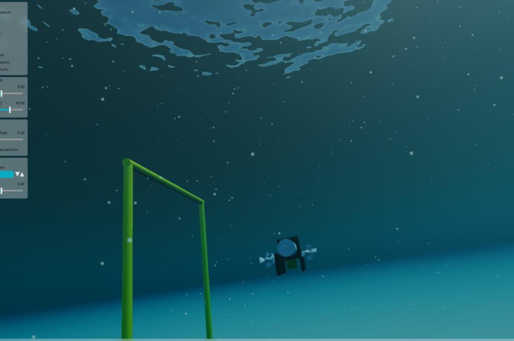

=======================
Simulation Integrations
=======================

We integrate Stonefish Simulation into the autonomy stack so you can run missions end-to-end in a realistic underwater environment.
This includes our own AUV models and integrations of well-known platforms used in the community.
